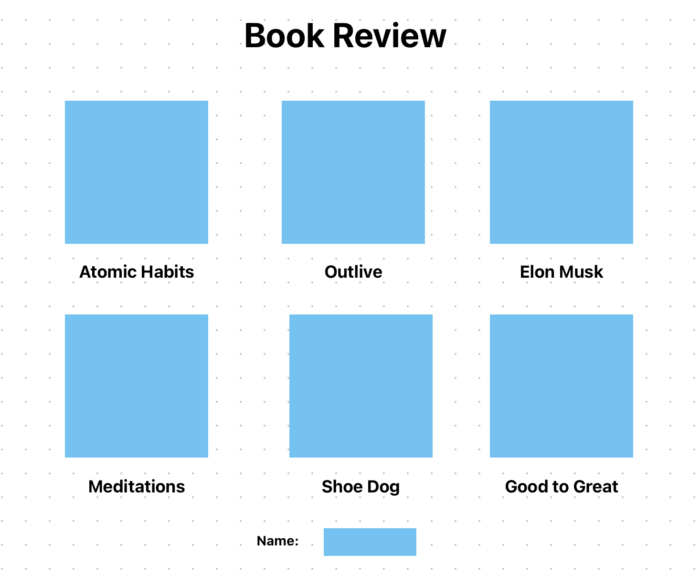
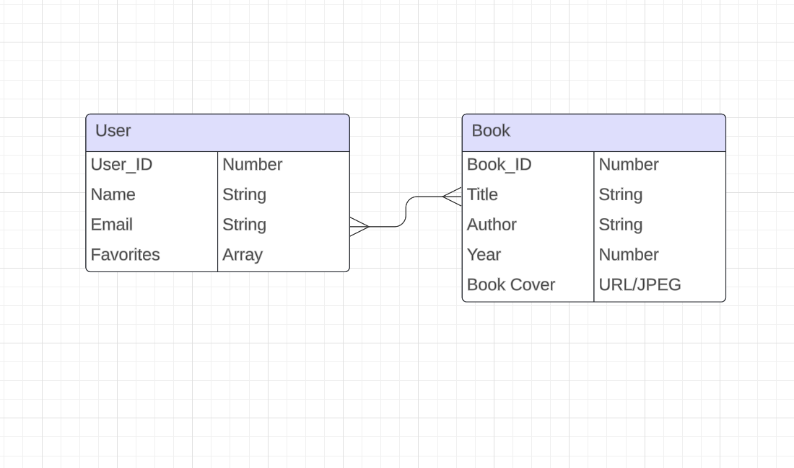
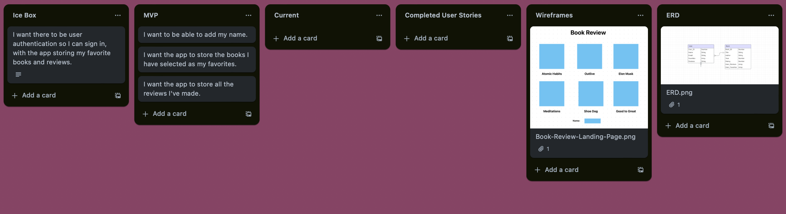

# 📚 Book App 

Description:  This is an app where users can choose from a list of books their favorite.  They can also add, edit, and delete books.

## User Stories

### Ice Box
- I want there to be user authentication so I can sign in, with the app storing my favorite books.
- I want to be able to add reviews to the books.

### MVP

- I want to be able to add my name and email for storage.
- I want the app to store the books I have selected as my favorites.

### Current

- The MVP goals have been met.

### Completed

- I want to be able to add my name and email for storage.
- I want the app to store the books I have selected as my favorites.

## Wireframe

## ERD

## Trello
https://trello.com/b/Q7gvS6gg/book-app

## Repositories

### Front End
- https://github.com/MarkoM71/Book-App-Front-End

### Back End
- https://github.com/MarkoM71/Book-App

## Technologies Used

- HTML, CSS, JavaScript, Node, Express, MongoDB 

